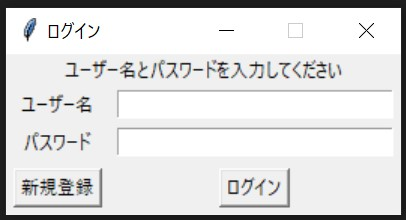
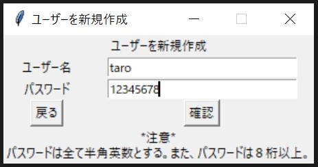
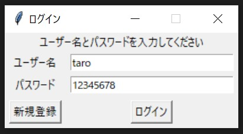
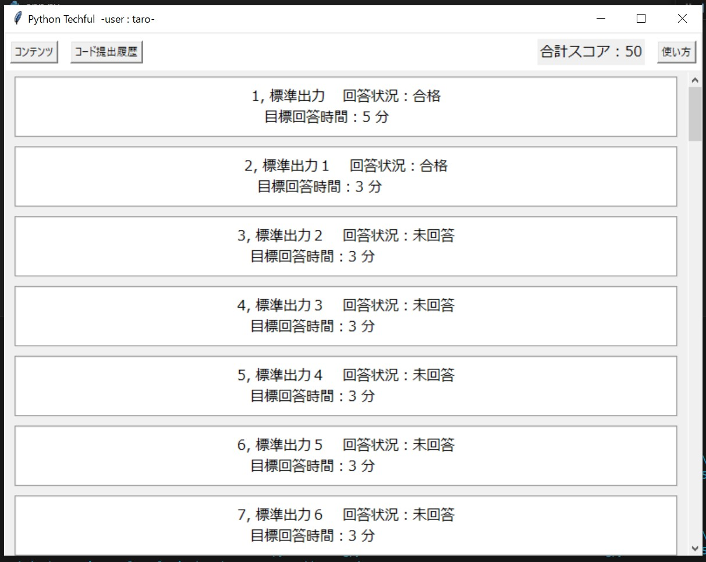
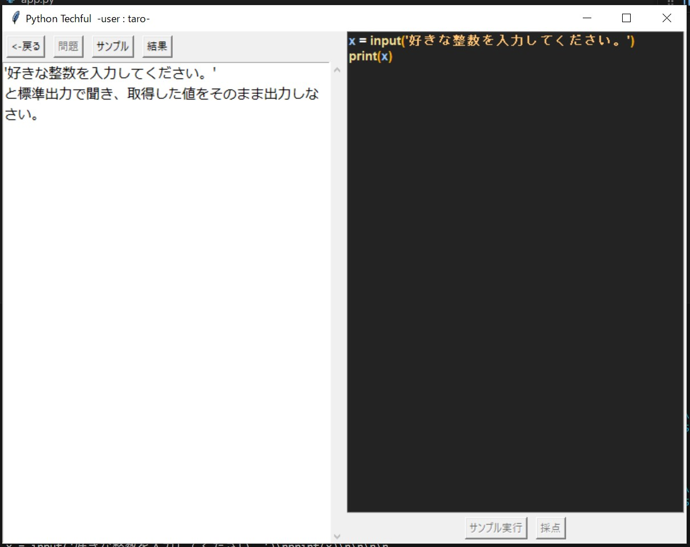
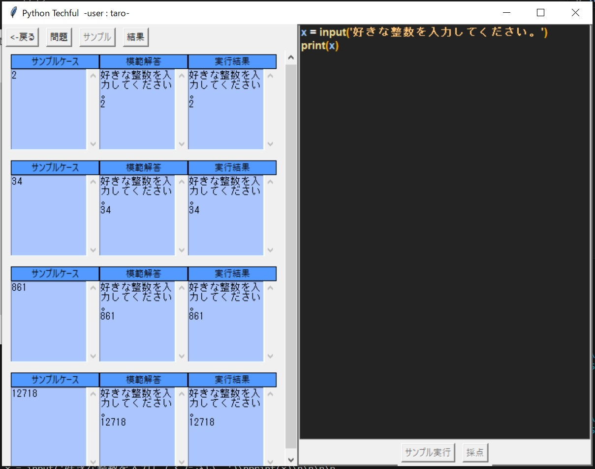
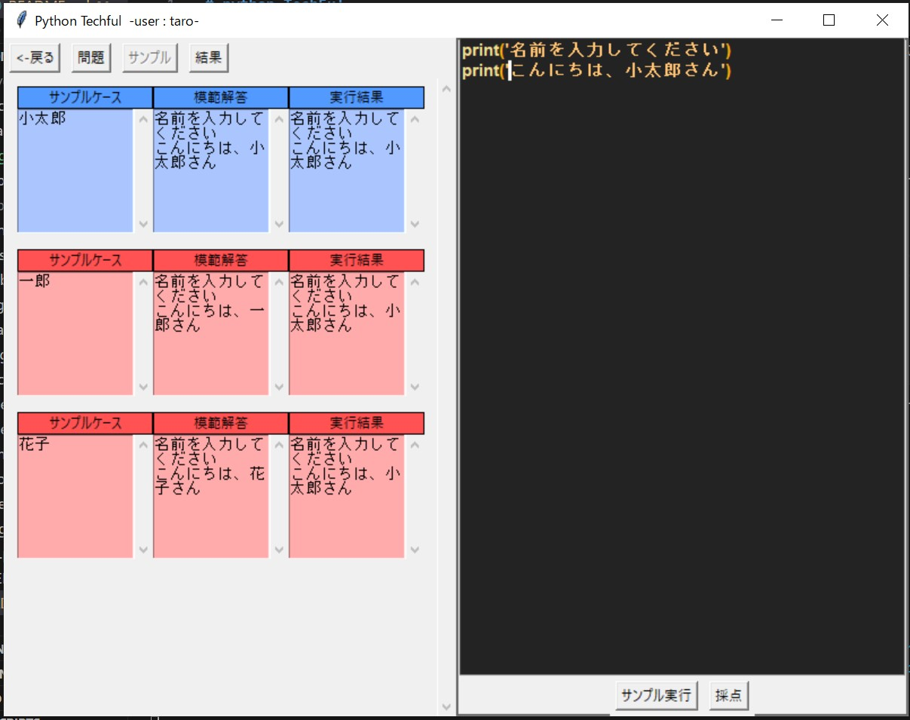
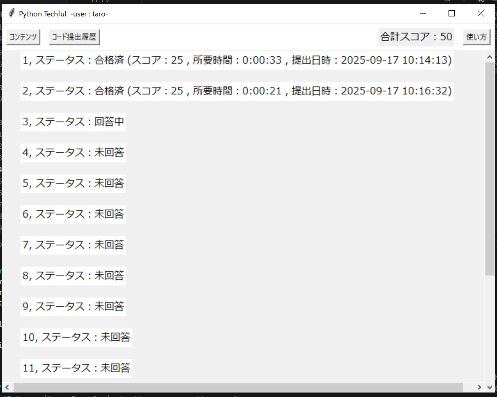

# python-TechFul
> 2025年前期 情報処理 アプリ開発課題

## 使用方法
1. app.py を実行するとログインウィンドウが起動する。

2. （最初のみ）新規登録を押すと、ユーザーの追加ができる。登録完了したら、ログイン画面に戻る

3. ログインする

4. ログインすると、コンテンツ画面に移る。

カーソルを合わせると、ボタンのいろいがかわる。色が変わったところをクリックすると回答開始になる。
※一度回答を開始すると、取りけしできません。
5. コンテンツ内の問題を選択して回答開始。
クリックして回答を開始すると、したのような画面になる。

左の問題文を読みながら、右の黒いエディターにプログラムを書き込んでいく。
プログラムが完成したら、サンプル実行ボタンを押すと、実行され、実行結果が "サンプル" のページで確認できる。

もし、サンプルが模範解答と一致していなければ、下の写真のようにケースごとに赤くなる。

※ずるはできません。

- コンテンツタブの横にあるコード提出履歴画面から提出日時やスコアが確認できる。

## 使用上の注意
- このアプリケーションは、ローカルでしかログイン処理がなく、パスワードなどはほかの機器とはつながっていない。そのため、登録した端末でのみログインできる。また、その端末のファイルエクスプローラーからすべてのユーザーの情報を見ることができるから、個人情報などの登録は絶対にやめること。

## プログラムファイルの機能
- app.py
    > このファイルを実行することでアプリが立ち上がる。
- scripts/loginPad.py
    > ログインの処理をしている。
    > ユーザーの新規登録すると、'data/.user-list.txt' にユーザー名とパスワードが保存される。その後、ログインした時は、入力情報が 'data/.user-list.txt' に存在するかを判別してログインしている。
- scripts/main.py
    > ログインした後にアプリを立ち上げるプログラム。
- scripts/pageSwap.py
    > 問題のリストを表示するプログラム。この中の処理で問題を解くページを開いたり、回答状況を確認したりできる。
- scripts/answerPage.py
    > 問題を解くページのプログラムをまとめている。タブの切り替えの処理をしている。
- scripts/samplePage.py
    > 実行時にサンプルケース・模範解答・実行結果を表示するプログラム。kotone.py 内で使用。
- scripts/scoringPage.py
    > 採点時のサンプルケースごとの正誤の表示・すべてのサンプルケースが正解の時のスコア計算と表示をするプログラム。kotone.py 内で使用。
- scripts/prompt.py
    > エディターのプログラム。デバッグ・実行結果取得・シンタックスハイライトを主にしている。
- scripts/questDataHandler.py
    > 問題のデータのハンドラ。関数で問題文・サンプルケース・模範解答などが抽出できる
- scripts/userDataHandler.py
    > ユーザーの回答状況などを抽出するハンドラ。
- scripts/run_temp/runProg{n}.py
    > サンプル実行時に n 番目のサンプルケースでの実行プルグラムを格納。
- scripts/debugTerminal.txt
    > sys でこのファイルにターミナルを移して実行している。
- data/questDict.csv
    > 問題のデータを保存してあるファイル。
- data/.user-list.txt
    > ユーザーのユーザー名とパスワードを保存してあるファイル。
- data/.{username}.csv
    > ユーザー名ごとの回答状況を保存するファイル。
- scripts/questMaker.py
    > 問題を作成するプログラム。実行時に出てくるウィンドウに問題文・サンプルケースなどを記入後、模範のプログラムを書いて実行。もし実行結果があっていれば、書き込み。書き込み先は 'data/questDict.csv'